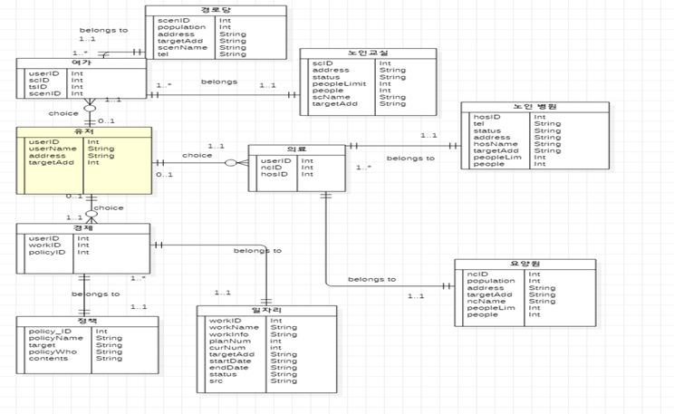
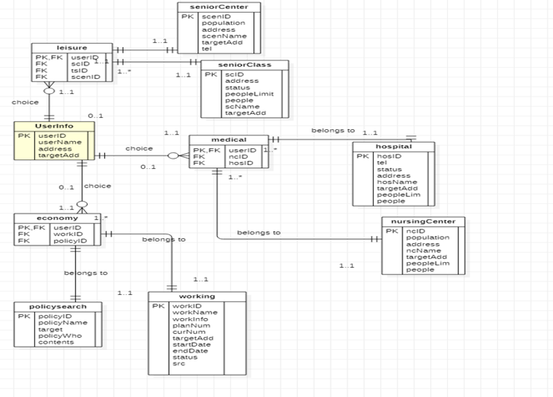
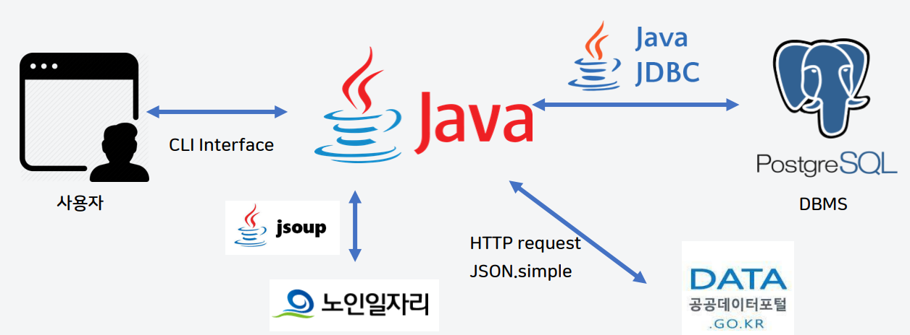

# 노인을 위한 나라는 있다.(2020.03 ~ 2020.06)

 

## 프로젝트 개요
의료 시설이 발전함에 따라 사람들의 기대 수명은 늘고 있습니다. 그로 인해 현대사회는 고령화 사회에 진입하고 있습니다.
노인들을 위한 서비스는 점점 중요해지고 있지만, 사전조사 결과 노인들을 위한 맞춤형 정보 제공 서비스는 거의 찾아볼 수 없었습니다.
노인들이 겪고 있는 문제점을 조사해본 결과 크게 3가지(경제, 여가, 의료)를 중심으로 많은 문제점을 겪는 것을 확인할 수 있었습니다.
현 프로젝트는 입력한 정보를 기반으로 서비스를 제공하는 것을 목표로 하고 있습니다.

## 개발 도구
- DBMS: Postgresql + pgadmin
- 개발 언어: Java
- 개발 환경: InteliJ
- API Test Tool: Insommnia
- 데이터
  - 공공데이터포털
  - 경기데이터포털
  - 한국노인인력개발원

## 기능
- 경제
  - 일자리 검색
  - 노인 복지 정책 검색
- 여가
  - 노인 복지 시설 검색
  - 노인 대상 참여형 활동 정보 검색
- 의료
  - 의료 시설 정보 검색

## 데이터 스키마

### UML Schema
  

### Relational_Schema
 

## 시스템 구조
 

## 발표 자료
[1차 발표](https://github.com/pika96/2019_Elderly_welfare/blob/master/%EB%B0%9C%ED%91%9C%20%EC%9E%90%EB%A3%8C/1%EC%B0%A8%20%EB%B0%9C%ED%91%9C.pdf)

[최종 발표](https://github.com/pika96/2019_Elderly_welfare/blob/master/%EB%B0%9C%ED%91%9C%20%EC%9E%90%EB%A3%8C/%EC%B5%9C%EC%A2%85%20%EB%B0%9C%ED%91%9C.pdf)

## 시연 연상

## 느낀 점
- 데이터 베이스를 이해하고 활용하는 것에 중점을 두어 다른 부분은 신경 못썼지만 데이터 베이스에 대해 알 수 있었다.